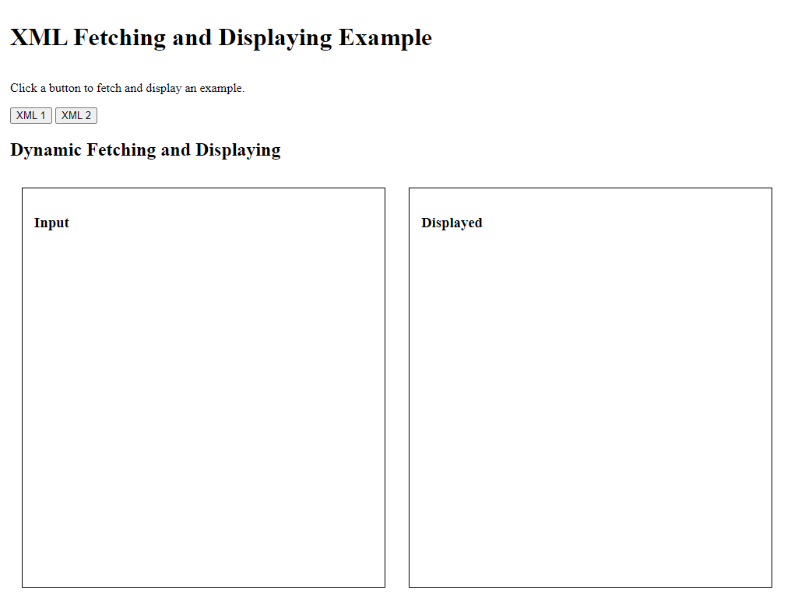
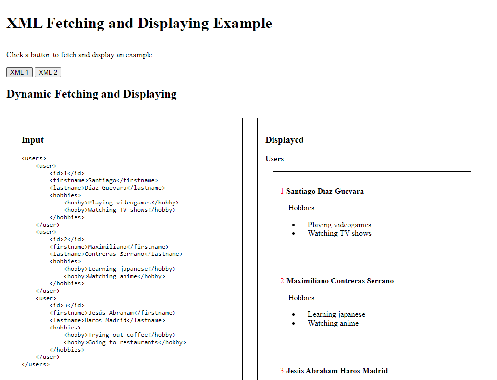
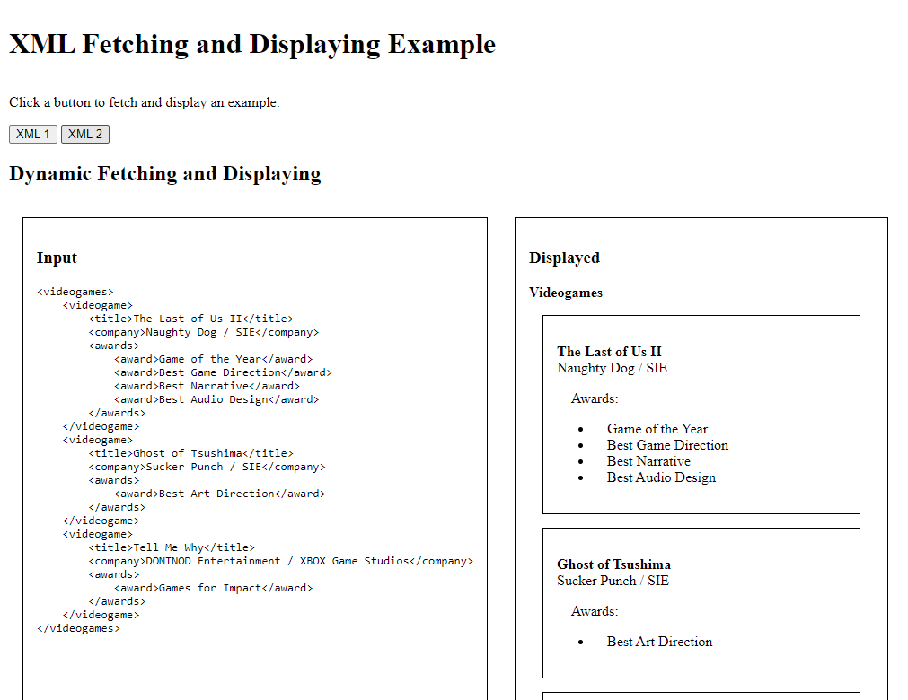

# XML Fetching and Displaying example

This project is an example of how to fetch an XML file and display it on a website.

This is how it looks like on first load:

You may click any of the two buttons shown. Both will load different XML files with different schemas
and display both the raw data on the left and an HTML styled format on the right.

## Example 1:

## Example 2:

## Structure

The main script is located in `assets/index.js`. It instanciates a Users and a Videogames object
with which it sets up the button triggers to fetch and display the data.

Inside the `assets` directory is found two other directories: `users` and `videogames`. These directories
hold the styles, scripts and XML example files for each entity. Both entities use the same pattern to handle
fetch, display, and style the data.
